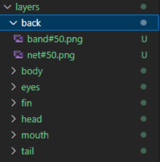
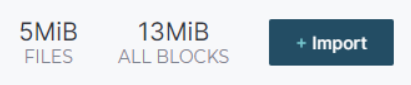
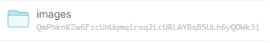
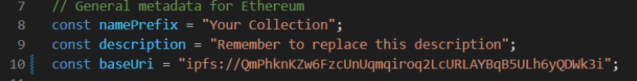

# How to use hashlips

`npm install` 

1. 이미지 설정하기

   `layers` 디렉토리에 합쳐질 이미지를 폴더로 나누어서 넣는다.

   각 폴더별로 이름 뒤에 `#(확률)` 을 기입해 주면 확률을 설정할 수 있다.

   

   이 상태에서 `npm run build`를 실행하면 `build` 디렉토리 안에 이미지와 메타데이터 json 파일이 생성된다.

2. IPFS에 업로드하기

   IPFS 로컬에 이미지를 업로드한다.

   

   Import 버튼을 통해 만들어진 `build/images` 폴더를 업로드한다.

   

   업로드한 폴더의 CID를 복사한다.

3. IPFS와 만들어진 이미지 연결하기

   다시 hashlips로 돌아가서,

   `src/config.js` 의 General metadata for Ethereum 설정을 변경한다.

   

   10번째 줄 `baseUri` 의 `ipfs://` 뒤에 2번 단계에서 복사한 CID를 붙여넣는다.

   이외의 다른 값도 설정하면 만들어진 json의 metadata값을 변경할 수 있다.

   변경한 상태에서 `npm run update_info` 를 실행하면 `build/json` 파일 안의 metadata가 변경된 것을 확인할 수 있다.

4. 확인하기

   `build/json` 안에 들어있는 파일 중 하나의 `"image"` 값을 주소창에 넣으면 업로드된 이미지를 확인할 수 있다.